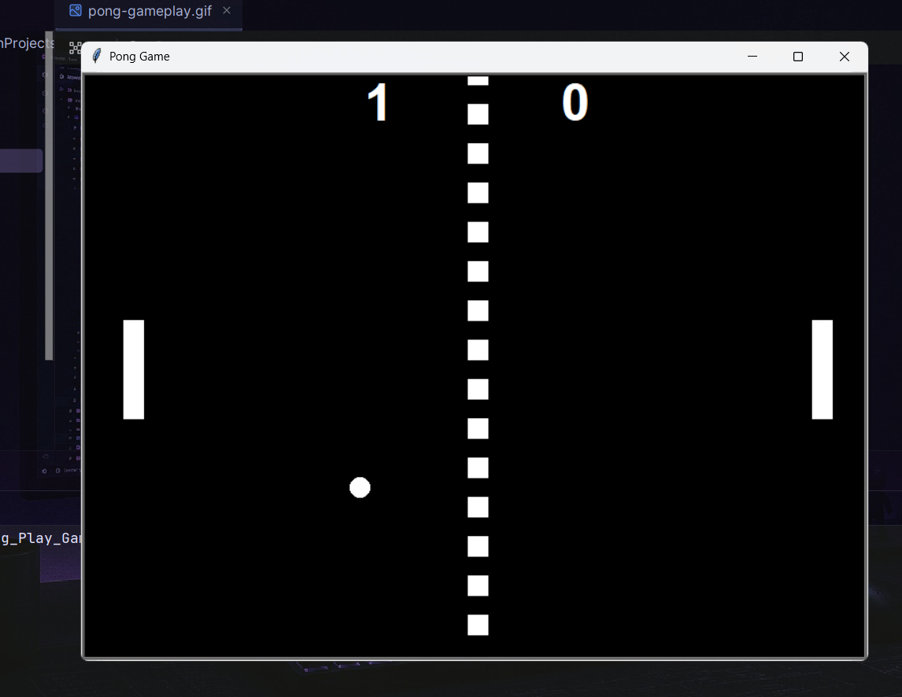
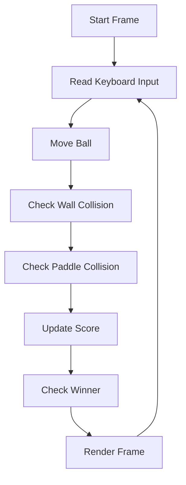
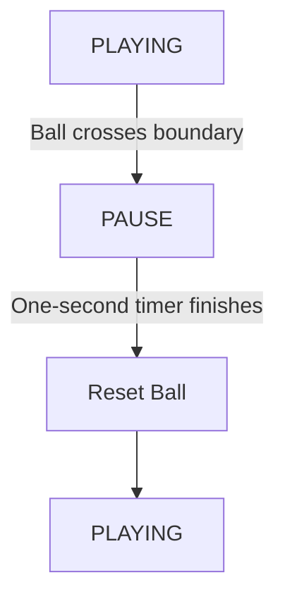
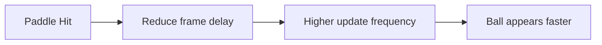

# 🏓 Pong Game


A classic two-player Pong game built with **Python** and the built-in **Turtle Graphics** library.

Although inspired by the original arcade game, this project was developed with an emphasis on **clean architecture**, **object-oriented design**, and **maintainable game logic** rather than simply recreating the gameplay.

---

## 📸 Preview





---

## ✨ Features

* **Two-player** local gameplay
* **Smooth paddle movement** with boundary detection
* **Ball collision** with walls and paddles
* **Progressive ball speed increase** after each paddle hit
* **Live score tracking**
* **Automatic winner detection**
* **Game Over screen**
* **Pause / Resume** support
* **Quit game** shortcut
* **Center dashed net**
* **Modular object-oriented architecture**

---

## 🎮 Controls

| Key | Action |
| :--- | :--- |
| <kbd>W</kbd> | Left Paddle Up |
| <kbd>S</kbd> | Left Paddle Down |
| <kbd>↑</kbd> | Right Paddle Up |
| <kbd>↓</kbd> | Right Paddle Down |
| <kbd>Space</kbd> | Pause / Resume |
| <kbd>Q</kbd> | Quit Game |

---

## 🛠 Technologies Used

* **Python 3**
* **Turtle Graphics**
* **Object-Oriented Programming (OOP)**

---

## 📁 Project Structure

```text
Pong-Game/
│
├── main.py              # Game controller and main loop
├── ball.py              # Ball movement, collision, speed control and reset
├── paddle.py            # Paddle movement and boundary handling
├── scoreboard.py        # Score tracking, winner detection and Game Over display
├── net.py               # Center dashed net creation
│
├── assets/
│   ├── pong-screenshot.png
│   └── pong-gameplay.gif
│
├── README.md
└── .gitignore

```

---

## 🏗 Project Architecture

Each class is responsible for one specific part of the game.

| Class | Responsibility |
| :--- | :--- |
| **Ball** | Ball movement, bouncing, speed control, and reset |
| **Paddle** | Player movement and screen boundaries |
| **Scoreboard** | Score management, winner detection, and Game Over display |
| **Net** | Draws the center dashed line |
| **main.py** | Coordinates all game objects and controls the game loop |

> [!NOTE]
> Keeping responsibilities separated makes the project easier to understand, maintain, and extend.

---

## 🔄 Game Loop

The game follows a frame-based update cycle.



Instead of allowing individual classes to control the entire game, `main.py` acts as the **central coordinator** that decides **when** each action should occur.

---

## ⚙️ Game State System

One design choice in this project was replacing blocking pauses with a simple game state system.

The game switches between two states:



During the **PAUSE** state:
* The main game loop continues running.
* Keyboard input remains responsive.
* The ball temporarily stops moving.
* After the timer expires, play resumes automatically.

This approach keeps the program responsive while avoiding unnecessary blocking logic.

---

## 🎯 Collision Detection

Paddle collisions are validated using two conditions:

```text
Ball touches paddle  AND  Ball is moving toward the paddle
```

> [!IMPORTANT]
> This prevents multiple bounce detections while the ball is still overlapping a paddle, resulting in more reliable gameplay.

---

## ⚡ Progressive Ball Speed

Instead of increasing the movement distance each frame, the game gradually decreases the delay between frames after every successful paddle hit.



This keeps the movement smooth while steadily increasing the game's difficulty.

---

## 💡 Design Decisions

Several parts of the project were intentionally separated to keep responsibilities clear.

* `Ball` changes **how** the ball moves.
* `Scoreboard` manages score data and determines the winner.
* `main.py` decides **when** events happen.
* Rendering and game logic are handled independently whenever possible.

This separation made the code easier to debug and allowed new features to be added without heavily modifying existing classes.

---

## 🧠 Concepts Practiced

* **Object-Oriented Programming (OOP)**
* **Encapsulation**
* **Single Responsibility Principle (SRP)**
* **Class Interaction**
* **Event Handling**
* **Collision Detection**
* **Frame-Based Animation**
* **Game Loop Design**
* **State Management**
* **Timer-Based Events**
* **Keyboard Listeners**
* **Modular Project Organization**

---

## 🚀 Running the Project

1. **Clone the repository:**
   ```bash
   git clone https://github.com/Anjan7797/Pong-Game.git
   ```

2. **Move into the project directory:**
   ```bash
   cd Pong-Game
   ```

3. **Run the game:**
   ```bash
   python main.py
   ```

---

## 📈 Possible Improvements

* Single-player mode with AI
* Main menu
* Difficulty selection
* Sound effects
* Countdown before each serve
* Configurable winning score
* Visual effects and animations

---

## 👨‍💻 About This Project

This project was built as part of my Python learning journey to strengthen my understanding of object-oriented programming and game development fundamentals.

Beyond recreating Pong, the goal was to write code that is modular, readable, and easy to extend while exploring concepts such as game loops, state management, collision detection, and class responsibility.

---

## 📄 License

This project is licensed under the MIT License. 
The project started as a simple Pong recreation and evolved into an exploration of game architecture, object interaction, and state-based programming.
